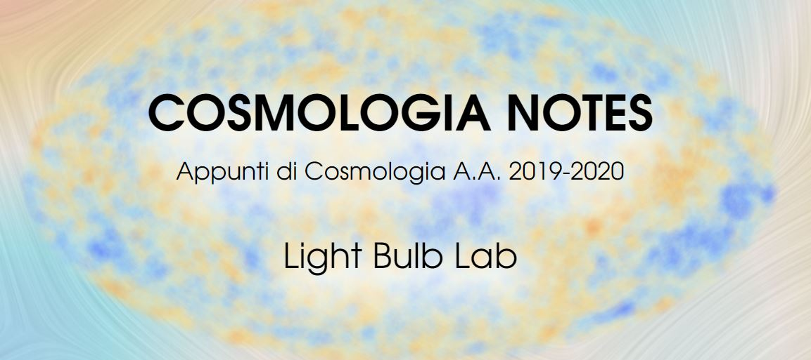

# Cosmologia Notes
### Appunti di Cosmologia A.A. 2019-2020

*Come ogni piatto di cucina moderna è incompleto senza una salsa di accompagnamento, così
anche i corsi universitari necessitano di una guida che armonizzi i contenuti e li spinga in un altra
dimensione. Inoltre, giunti a questo punto, avrete sicuramente maestria nell’utilizzo di strumenti
matematici avanzati (non siate modesti!). Pertanto i conti e le dimostrazioni li vedrete in classe e
proverete a rifarli da soli quando studierete, un’ulteriore trattazione completa sarebbe pedissequa.
Da queste esigenze sono state partorite le Cosmologia Notes. Per rendere più agevole la lettura, questo
testo potrebbe leggermente discostarsi dalle lezioni frontali nei Capitoli 4 e 5. Non garantiamo
una perfetta fluidità e chiarezza, ma tanto divertimento e tante figure glitterate. Nell’ultimo capitolo
sono riportati una serie di spunti di approfondimento dalla letteratura.*

### Capitoli e contenuto
1. **Introduzione**: metrica e distanze
2. **Universi di Friedmann**: equazioni di Friedmann e soluzioni, orizzonte cosmologico
3. **Evoluzione termica dell'Universo**: temperatura e redshift pre e post disaccoppiamento
4. **Cinque problemi del Modello Standard**: origine, orizzonte, piattezza, monopoli magnetici e costante cosmologica
5. **Storia cronologica dell'Universo**: modello di Guth, inflazione caotica, era adronica, leptonica, nucleosintesi primordiale
6. **Un universo... Perturbato**: formazione delle strutture, teoria di Jeans classica e cosmologica
7. **Un'oscillazione non è per sempre**: hot N cold dark matter, free streaming e dissipazione
8. **Statistica con un oggetto**: proprietà stocastiche delle perturbazioni, spettro di Zeldovich
9. **Evoluzione non lineare**: approssimazione di Zeldovich, virializzazione, teoria di Press-Schechter, simulazioni numeriche
10. **Clustering**: funzione di correlazione angolare, risultati osservativi
11. **Cosmic Microwave Background**: anisotropie primarie e secondarie, risultati osservativi
12. **Dalla letteratura**: articoli e approfondimenti

Try using inline HTML <a href="https://lightbulblab.github.io/Cosmologia-Notes/" download>Download</a> 
